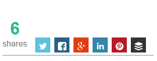

# Social Share Button Graph

This library consist of a **PHP** Back-end and a **JavaScript/HTML/CSS** Front-end to create a nice Bar Graph like the preview image below shows.

It is more then just a Bar Graph to show the Social Network Share count of a web page across the big Social Networks.

It also is a fully functional Social Network Share Script.  Each Networks Bar Graph is clickable which in turn opens a pop-up window populated with data from the web page to share on that network.

When the page loads, the Social Bar Graph animates into place and the total count combined of all Social Shares, counts up in an animated way to it's total.

## Preview Animated Image ##

## Other Info ##

Nothing yet!

Code will be released soon when it is finished and in a more releasable state.

This project was built for usage on [https://www.ApolloWebStudio.com](https://www.apollowebstudio.com "Web Development and Marketing Studio")

Feel free to visit my [Web Development Blog](http://www.codedevelopr.com "Web Development Blog") -  [http://www.CodeDevelopr.com](http://www.codedevelopr.com "Web Development Blog")

**&**

Follow me on Twitter
[@JasonDavisFL](http://twitter.com/#!/JasonDavisFL "@JasonDavisFL on Twitter")
